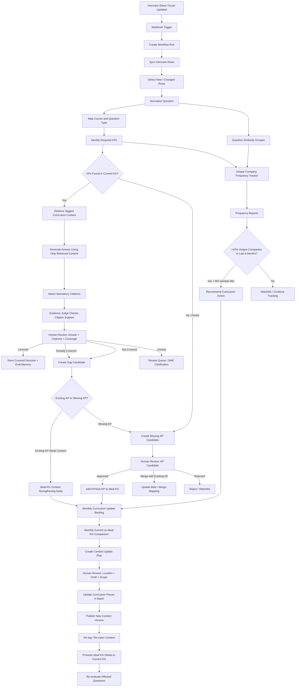
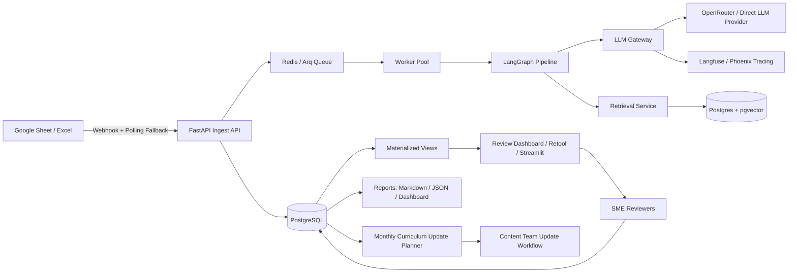
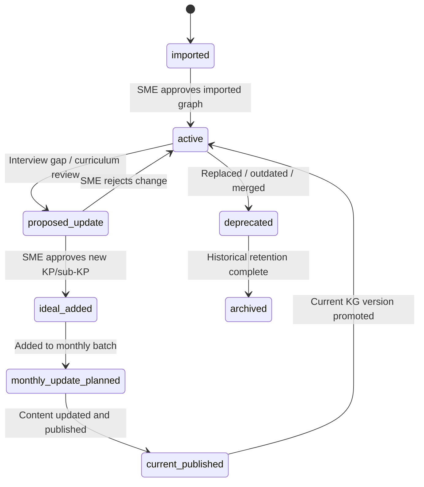
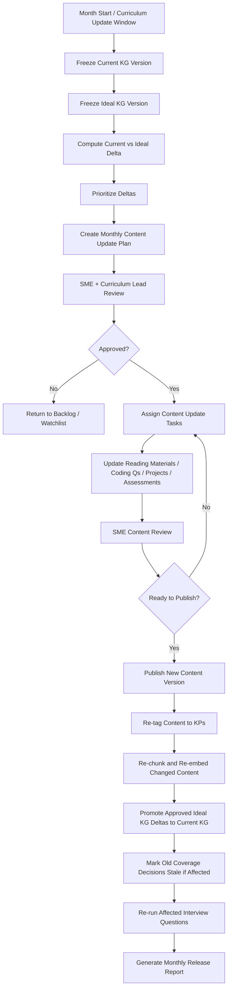

# Final PRD — Interview Curriculum Gap Intelligence Application v4

## Document Status

| Field | Value |
| --- | --- |
| Product | Interview Curriculum Gap Intelligence Application |
| Version | v4 — Knowledge Graph + Ideal Graph + Monthly Curriculum Update Workflow |
| Primary Users | SMEs, Curriculum Leads, Content Operations, Engineering Team |
| Main Goal | Determine whether delivered curriculum prepares students for interview questions, identify gaps, update the curriculum knowledge graph, and support monthly curriculum update cycles. |
| Core Principle | Coverage must be proven by delivered curriculum content with citations. The knowledge graph improves retrieval, tagging, gap tracking, and curriculum planning, but it does not alone prove coverage. |

---

# 1. Executive Summary

We need an application that continuously compares real interview-question data with the delivered curriculum.

The application will:

1. Ingest interview questions from Google Sheets or Excel whenever the source updates.
2. Ingest delivered curriculum content such as reading materials, coding questions, projects, assessments, and other curriculum pieces.
3. Maintain a **Current Curriculum Knowledge Graph** built from knowledge points, sub-knowledge-points, and prerequisite/relationship edges.
4. Link every curriculum content piece to one or more knowledge points.
5. Use the current knowledge graph and content tags to retrieve relevant delivered curriculum content.
6. Generate answers to interview questions using **only retrieved delivered curriculum content**.
7. Attach mandatory content citations to every answer.
8. Route answers, citations, and coverage decisions to human review.
9. Store human feedback as eval memory so the system gradually improves.
10. Track interview question frequency across unique companies, including rephrased/similar questions.
11. Identify gaps where interview questions require knowledge points that are absent or insufficiently covered.
12. Add approved missing knowledge points or sub-knowledge-points to an **Ideal Curriculum Knowledge Graph**.
13. Use the Ideal Curriculum Knowledge Graph as the target state for monthly curriculum updates.
14. Once every month, compare the Current Curriculum Knowledge Graph and Ideal Curriculum Knowledge Graph, plan curriculum updates, update content pieces in one batch, republish curriculum, re-tag content, re-index evidence, and re-evaluate affected questions.

This version introduces a key workflow update:

> Curriculum is not updated immediately for every approved gap. Approved gaps update the Ideal Curriculum Knowledge Graph first. Curriculum content updates are batched and executed monthly.

---

# 2. Problem Statement

The curriculum team receives interview data from multiple companies. Some questions are already covered in the delivered curriculum, some are partially covered, and some require new concepts or deeper practice.

Currently, the process is manual and difficult to scale because:

- Interview questions may be phrased differently across companies but test the same concept.
- It is difficult to know whether students can answer a question using only delivered content.
- It is difficult to prove coverage with exact curriculum citations.
- The curriculum knowledge graph may not contain all knowledge points and sub-knowledge-points needed by real interview questions.
- Updating the curriculum immediately for every gap is operationally expensive.
- Curriculum updates usually happen in monthly cycles.
- If the graph and content are not versioned, old coverage decisions can become stale after curriculum updates.

The system must solve this by combining:

- Citation-backed answer generation
- Human review
- Eval memory
- Frequency intelligence
- Current vs Ideal knowledge graph comparison
- Monthly curriculum update workflow

---

# 3. Business Objectives

## 3.1 Primary Objective

Create a repeatable, evidence-backed, human-reviewed system that converts interview-question data into curriculum coverage decisions, gap candidates, knowledge graph updates, and monthly curriculum update plans.

## 3.2 Business Benefits

| Benefit | Explanation |
| --- | --- |
| Better placement readiness | Curriculum updates are driven by actual interview questions and company frequency. |
| Stronger evidence | Coverage is based on delivered content citations, not assumptions. |
| Safer automation | Human review remains the gate for uncertain answers, missing KPs, and content changes. |
| Better graph quality | Missing KPs and sub-KPs are added gradually based on real interview needs. |
| Monthly update discipline | Curriculum updates are batched once per month instead of happening in an ad-hoc manner. |
| Reduced false confidence | A concept present in the graph is not automatically considered covered. Delivered content must support it. |
| Improved curriculum planning | Current vs Ideal Knowledge Graph comparison shows exactly what needs to change. |
| Continuous learning | SME feedback improves future decisions through eval memory and eval sets. |

---

# 4. Key Definitions

## 4.1 Knowledge Point

A **Knowledge Point (KP)** is a specific skill, concept, sub-skill, or capability that students must understand or apply.

Examples:

```text
Variable Assignment
Type Recognition
String Slicing
Nested Iteration
Matrix Rotation
useEffect Cleanup
JWT Token Validation
MongoDB Aggregation Pipeline
```

A KP should be atomic enough to support tagging, retrieval, coverage review, and curriculum update decisions.

## 4.2 Sub-Knowledge Point

A **Sub-KP** is a finer-grained child or implementation detail under a broader KP.

Example:

```text
KP: React useEffect
Sub-KPs:
- useEffect dependency array
- useEffect cleanup function
- useEffect infinite loop prevention
```

The graph should support both KPs and sub-KPs using the same `knowledge_points` table with relationship edges.

## 4.3 Current Curriculum Knowledge Graph

The **Current Curriculum Knowledge Graph** represents the currently delivered curriculum.

It contains:

- Existing KPs
- Existing sub-KPs
- KP descriptions
- KP levels and tiers
- Relationship edges such as `requires`
- Content pieces tagged to KPs
- Course/topic/session metadata
- Content versions currently live

This graph answers:

```text
What does our delivered curriculum currently claim to teach?
Which content pieces are linked to each KP?
Which KPs depend on other KPs?
```

Important:

```text
The Current Curriculum Knowledge Graph helps retrieval and curriculum mapping.
It does not alone prove coverage.
Coverage is proven only through delivered content citations and human review.
```

## 4.4 Ideal Curriculum Knowledge Graph

The **Ideal Curriculum Knowledge Graph** is the target graph that represents what the curriculum should contain based on approved interview gaps.

It contains:

- All current approved KPs
- Newly approved missing KPs
- Newly approved sub-KPs
- Proposed edges between KPs
- Proposed course/topic/session location
- Proposed content update needs
- Review status and release batch mapping

This graph answers:

```text
What should the curriculum eventually teach based on interview data?
What KPs are missing from the current graph?
Where should the new KP be added?
Which curriculum pieces need to be updated during the monthly update cycle?
```

The Ideal Graph is not automatically published to students. It is a planning and comparison layer.

## 4.5 Delivered Content

Delivered content means curriculum assets that students can currently access.

Examples:

```text
Reading materials
Coding questions
Projects
Assessments
Practice questions
Quizzes
Tutorials
Session notes
Trainer reference material, if used for delivery
```

## 4.6 Content Citation

A citation is a pointer to the exact delivered content used to support an answer.

A reviewer should see:

```text
Course
Topic
Session
Content type
Content title
Knowledge point
Content version
Chunk/snippet
Line or paragraph reference, if available
```

Internal systems may store chunk IDs, but reviewers should see readable citations.

## 4.7 Coverage

A question is considered covered only when:

```text
The LLM can answer it using only delivered curriculum content,
AND the answer has valid citations,
AND the citations directly support the answer,
AND the human reviewer approves the answer and coverage status,
OR the system has reached an approved automation level for that specific slice.
```

## 4.8 Gap

A gap exists when:

- The current curriculum cannot answer the interview question.
- The answer is incomplete based on delivered content.
- Citations are weak, missing, or unsupported.
- A required KP is missing from the Current Curriculum Knowledge Graph.
- A KP exists in the graph but is not explained sufficiently in delivered content.
- Practice exposure is missing for coding/project-based interview questions.

---

# 5. Inputs

## 5.1 Interview Question Dataset

Source:

```text
Google Sheet / Excel interview-question data
```

Expected fields:

| Field | Required | Usage |
| --- | --- | --- |
| Question UUID | Optional but preferred | Stable tracking |
| Question | Required | Main interview item |
| Company Name | Required | Frequency and company spread |
| Role | Optional | Role relevance |
| Tech Stack | Optional | Course mapping |
| Question Type | Optional | Conceptual/coding/project/debugging classification |
| Skills Assessed Remarks | Optional | Grounding for KP identification |
| Remarks | Optional | Extra context |
| Product | Optional | Segmentation |
| Minimum CTC in LPA | Optional | Metadata only in MVP |
| Maximum CTC in LPA | Optional | Metadata only in MVP |
| Interview Date / Source Date | Preferred | Required for 6-month frequency window |

## 5.2 Current Knowledge Point Graph Files

The initial graph is supplied using two curated CSV files.

### 5.2.1 Knowledge Point File

File:

```text
skills-export_curated.csv
```

Observed columns:

| Column | Meaning |
| --- | --- |
| id | Internal row ID |
| graph_id | Graph identifier |
| skill_id | Stable KP identifier |
| name | Human-readable KP name |
| tier | Foundational/core/applied/advanced classification |
| level | Numeric learning level or sequence |
| description | Definition and mastery expectation |
| transferable_contexts | Contexts where the KP can be applied |
| created_at | Creation timestamp |
| subtopic_id | Linked curriculum subtopic/session metadata |

### 5.2.2 Knowledge Point Edge File

File:

```text
skill_edges_export_curated.csv
```

Observed columns:

| Column | Meaning |
| --- | --- |
| id | Internal edge ID |
| graph_id | Graph identifier |
| from_skill | Source KP skill_id |
| to_skill | Target KP skill_id |
| relationship_type | Relationship type, e.g. `requires` |
| reason | Explanation for the edge |

The initial uploaded graph contains a curated set of KPs and prerequisite-style edges. The system must import this graph as the first version of the Current Curriculum Knowledge Graph.

## 5.3 Delivered Curriculum Content

Content sources:

```text
Reading materials
Coding questions
Projects
Assessments
Quizzes
Tutorials
Other delivered content
```

Each content piece must have:

| Field | Required | Notes |
| --- | --- | --- |
| content_id | Required | Stable content identifier |
| course_id | Required | Course mapping |
| topic_id | Required | Topic mapping |
| session_id | Required | Session mapping |
| content_type | Required | reading_material / coding_question / project / assessment / quiz / tutorial |
| title | Required | Human-readable title |
| body/content | Required | Text or structured content |
| version | Required | Content version |
| published_status | Required | draft / published / archived |
| last_updated_at | Required | Used for reindex and stale decision detection |
| source_path | Required | Folder/file path or sheet reference |

## 5.4 Content-to-KP Tags

Every content piece must be tagged with one or more KPs.

Expected tag fields:

| Field | Meaning |
| --- | --- |
| content_id | Content piece being tagged |
| chunk_id | Optional internal evidence unit |
| kp_id / skill_id | Knowledge point tag |
| tag_role | explain / example / syntax / practice / assessment / project / prerequisite / misconception |
| confidence | human-approved or system-suggested confidence |
| tagged_by | SME / system |
| review_status | approved / pending / rejected |
| content_version | Version of the content when tag was created |

MVP rule:

```text
SME-approved tagging is preferred for MVP.
Auto-tagging can be introduced later, but it should not be the only source of truth for coverage.
```

## 5.5 Course Structure Metadata

Course structure should include:

```text
Course
Topic
Unit
Session
Content pieces
Assessments
Projects
Expected learning outcomes
```

Supported MVP courses:

```text
Programming with Python
HTML
CSS
Building Dynamic Web Applications
JavaScript Essentials
React
NodeJS
MongoDB
Integration of Frontend and Backend
```

---

# 6. MVP Scope

## 6.1 In Scope

| Area | MVP Decision |
| --- | --- |
| Interview input | Google Sheet / Excel interview-question data whenever it updates |
| Content input | Reading materials, coding questions, projects, assessments, and other delivered content |
| Course structure | Course/topic/session metadata |
| Current KG | Import curated KP graph from skills and edges CSV files |
| Ideal KG | Maintain target graph with approved missing KPs and proposed edges |
| Tagging model | Each content piece tagged with knowledge points |
| Tagging review | Human reviewer validates tagging and course structure |
| Answer generation | LLM answers using only retrieved curriculum content |
| Citations | Mandatory content citations for every answer |
| Human review | Reviewer validates answer, citations, KP mapping, and coverage status |
| Feedback memory | Store reviewer decisions and reasons as eval memory |
| Frequency tracking | Track question frequency across unique companies, including rephrased questions |
| Curriculum update rule | If a question/KP is asked by more than 10% of unique companies in the last 6 months, recommend curriculum action, subject to minimum sample-size rules |
| New KP handling | If approved question requires a KP not present in Current KG, create proposed KP/sub-KP and add it to Ideal KG after human approval |
| Monthly update | Compare Current KG vs Ideal KG once per month and plan curriculum updates in batch |
| Draft and location | Create proposed content draft/location for missing or weak KPs |
| Draft review | Human reviewer validates whether proposed content and location align with curriculum needs |
| Orchestration | LangGraph or equivalent stage-based workflow |
| Storage | PostgreSQL + pgvector |
| LLM provider | OpenRouter API or configured direct LLM provider |
| Reports | Markdown, JSON, dashboard view |
| Output | Coverage decisions, gap candidates, frequency reports, graph delta reports, monthly update plan, draft content specs, removal candidates |

## 6.2 Out of Scope for MVP

| Area | MVP Decision |
| --- | --- |
| Fully automatic curriculum publishing | Not allowed |
| Fully automatic deletion of content | Not allowed |
| Fully automatic coding/project coverage decision | Not allowed unless exact/same-equivalent delivered content exists and the slice has reached the approved automation level |
| Auto-tagging as source of truth | Deferred; human-approved tags are preferred |
| PPT/video generation | Out of scope |
| Image OCR | Out of scope |
| Browser-based link resolver | Out of scope |
| Large-scale custom review UI | Use Retool/Streamlit/Appsmith initially |
| L3/L4 full automation | Post-MVP only after proven accuracy |

---

# 7. Core Product Principles

1. **Delivered content is the source of coverage truth.**
   The graph helps retrieval and planning, but citations from delivered content prove coverage.

2. **Frequency does not prove coverage.**
   A question asked by many companies may still be uncovered.

3. **Coverage and curriculum priority are separate decisions.**
   Coverage asks: “Can students answer this using current content?”
   Priority asks: “Should we add or strengthen this because many companies ask it?”

4. **Current Graph and Ideal Graph must remain separate.**
   The Current Graph reflects delivered curriculum. The Ideal Graph reflects approved future needs.

5. **Monthly curriculum update is the publishing boundary.**
   Approved gaps update the Ideal Graph immediately but update curriculum content only during the monthly update cycle.

6. **Every LLM stage must have contracts.**
   Each stage needs schema, prompt version, model version, retries, cost logging, eval set, and failure status.

7. **Human review remains the safety layer.**
   The system can suggest, but SMEs approve uncertain coverage, new KPs, graph changes, content drafts, and curriculum updates.

8. **Avoid false-covered decisions.**
   The system should prefer human review over wrongly marking something as covered.

---

# 8. High-Level Application Flow



---

# 9. System Architecture

## 9.1 Recommended Topology



## 9.2 Component Choices

| Component | Recommendation | Reason |
| --- | --- | --- |
| API | FastAPI | Pydantic-native and fast to build |
| Worker | Arq or Celery | Background jobs and batch runs |
| Orchestration | LangGraph or equivalent | Durable stage-based workflow |
| Database | PostgreSQL 15+ | Relational state, JSONB, audit logs |
| Vector DB | pgvector | One DB for metadata + embeddings |
| Cache | Redis | LLM cache, queue, rate limits |
| LLM Gateway | Custom wrapper | Prompt/version/cost/retry consistency |
| Review UI | Retool/Streamlit/Appsmith | Faster MVP than custom UI |
| Tracing | Langfuse/Phoenix/LangSmith | LLM traces, prompt versions, costs |
| Reports | Markdown + JSON + Dashboard | Human and system consumption |

---

# 10. Knowledge Graph Model

## 10.1 Graph Types

The system must maintain at least two graph types.

| Graph | Purpose | Update Timing |
| --- | --- | --- |
| Current Curriculum KG | Represents currently delivered curriculum | Updated after monthly curriculum publish |
| Ideal Curriculum KG | Represents approved target curriculum improvements | Updated continuously after human approval |

Optional later:

| Graph | Purpose |
| --- | --- |
| Experimental KG | LLM-proposed graph changes not yet approved |
| Archived KG | Historical graph versions for audit/replay |

## 10.2 Knowledge Point Schema

```json
{
  "kp_id": "kp_string_slicing",
  "graph_id": "graph_python_current_v1",
  "canonical_name": "String Slicing",
  "skill_id": "string_slicing",
  "tier": "core",
  "level": 3,
  "description": "Student can extract a substring using start/end indices.",
  "transferable_contexts": [
    "Extracting date parts",
    "Parsing codes",
    "String manipulation problems"
  ],
  "course_id": "programming_with_python",
  "topic_id": "strings",
  "session_id": "string_methods_and_slicing",
  "status": "active",
  "created_source": "curated_import | interview_gap | sme_created | llm_proposed",
  "owner_sme_id": "sme_001",
  "taxonomy_version": "current_v1",
  "created_at": "timestamp",
  "updated_at": "timestamp"
}
```

## 10.3 Knowledge Point Edge Schema

```json
{
  "edge_id": "edge_001",
  "graph_id": "graph_python_current_v1",
  "from_kp_id": "string_indexing",
  "to_kp_id": "string_slicing",
  "relationship_type": "requires",
  "reason": "Slicing generalizes indexing; students need indexing first.",
  "status": "active",
  "created_source": "curated_import | interview_gap | sme_created | llm_proposed",
  "review_status": "approved",
  "taxonomy_version": "current_v1"
}
```

## 10.4 Supported Relationship Types

| Relationship | Meaning | Example |
| --- | --- | --- |
| requires | One KP is a prerequisite for another | string_indexing → string_slicing |
| part_of | Sub-KP belongs to parent KP | useEffect_cleanup → useEffect |
| related_to | KPs are associated but not prerequisites | localStorage ↔ cookies |
| alternative_to | Different ways to solve similar need | fetch API ↔ axios |
| extends | Advanced KP builds on base KP | nested_iteration → matrix_traversal |
| deprecated_by | Old KP replaced by new KP | old_auth_flow → jwt_auth_flow |

MVP must support `requires`, `part_of`, `related_to`, and `deprecated_by`. Other edge types can be added later.

## 10.5 KP Lifecycle



## 10.6 Missing KP Handling

When an interview question requires a KP not present in the Current KG:

1. The KP Identifier stage marks the concept as `unmapped_or_missing`.
2. The Missing KP Candidate stage creates a proposed KP or sub-KP.
3. The system suggests:
   - KP name
   - Description
   - Tier
   - Level
   - Parent KP, if any
   - Prerequisite KPs
   - Related KPs
   - Course/topic/session location
   - Evidence from interview questions
   - Frequency signal
   - Rationale for addition
4. Human reviewer chooses:
   - Approve as new KP
   - Approve as sub-KP
   - Merge with existing KP
   - Add as alias to existing KP
   - Reject
   - Watchlist
5. If approved, the KP is added to the Ideal KG, not directly to the Current KG.
6. During monthly curriculum update, the Ideal KG is compared with the Current KG and curriculum pieces are updated.

## 10.7 KP Merge and Alias Rules

When two KPs mean the same thing:

```text
kp_python_constructor
kp_init_method
```

The reviewer can merge them.

Merge rules:

- One canonical KP remains active.
- The other KP becomes an alias or deprecated KP.
- Historical citations remain linked to the old KP but resolve to the canonical KP.
- Frequency counts roll up to the canonical KP.
- Eval memory entries are marked with both original and canonical KP IDs.
- All changes are logged in `kp_lifecycle_events`.

---

# 11. Content Versioning and Monthly Curriculum Update Model

## 11.1 Monthly Update Principle

Curriculum updates generally happen once every month.

The system must not assume instant curriculum publication.

When a gap is approved:

```text
Gap approved → Ideal KG delta created → Monthly update backlog → Content update plan → Human approval → Curriculum pieces updated → New content version published → Current KG promoted
```

## 11.2 Current vs Ideal Comparison

At the start of every monthly update cycle, the system compares:

```text
Current Curriculum KG
vs
Ideal Curriculum KG
```

The comparison must identify:

| Delta Type | Example |
| --- | --- |
| New KP | `useEffect cleanup` missing in current graph |
| New sub-KP | `JWT token expiry handling` under JWT Auth |
| New edge | `type_recognition requires type_conversion` |
| Changed KP description | Deeper interview-level explanation needed |
| Content strengthening | Existing KP present but content is weak |
| Practice addition | Existing KP has explanation but no coding practice |
| Assessment addition | Need MCQs or coding tests for KP |
| Location change | KP should move to a different session |
| Removal candidate | Low relevance, outdated, not prerequisite, not interview-relevant |

## 11.3 Monthly Update Cycle



## 11.4 Content Versioning Rules

Every content update must create a new content version.

Rules:

- Old citations must keep pointing to the old content version.
- New answers must use the latest published content version.
- If a content update materially changes a cited explanation, old coverage decisions become `stale_coverage_review_required`.
- If a content update only fixes grammar or formatting, old coverage decisions may remain valid.
- Changed content must be re-chunked and re-embedded.
- KP tags must be revalidated when content body changes materially.

## 11.5 Material vs Minor Content Change

| Change Type | Examples | Required Action |
| --- | --- | --- |
| Minor | Typo fix, formatting, heading change | Keep citations valid; no re-review needed |
| Material | Concept explanation changed, example added/removed, practice question modified | Re-index, re-tag, re-evaluate affected coverage decisions |
| Structural | Session moved, topic split, KP moved | Update graph mapping and content location |
| Deprecated | Content removed or replaced | Mark citations stale and re-evaluate dependent questions |

---

# 12. Interview Question Processing Workflow

## 12.1 Step 1 — Ingestion

Trigger sources:

```text
Google Sheet webhook
Excel upload
Scheduled polling fallback
Manual re-sync
```

System actions:

1. Read updated rows.
2. Normalize column names.
3. Validate required fields.
4. Create row fingerprint.
5. Detect new/changed/skipped rows.
6. Create or update workflow run.
7. Store raw row in `interview_rows`.

Idempotency key:

```text
hash(sheet_id + row_number + question + company + role + tech_stack + question_type + source_date)
```

## 12.2 Step 2 — Question Normalization

The system converts the raw interview row into structured form.

Output:

```json
{
  "question_id": "q_001",
  "raw_question": "Explain cleanup in useEffect",
  "normalized_question": "Explain the purpose of the cleanup function in React useEffect and when it runs.",
  "company": "TCS",
  "role": "Frontend Developer",
  "tech_stack": "React",
  "question_type": "conceptual",
  "domains": ["Frontend"],
  "technologies": ["React"],
  "detected_requirements": [
    "useEffect",
    "cleanup function",
    "component unmounting"
  ],
  "confidence": 0.91,
  "warnings": []
}
```

## 12.3 Step 3 — Course Mapping

The system maps the question to one or more courses.

Example:

| Tech Stack | Course |
| --- | --- |
| Python | Programming with Python |
| HTML | HTML |
| CSS | CSS |
| JavaScript | JavaScript Essentials / Building Dynamic Web Applications |
| React | React |
| Node.js | NodeJS |
| MongoDB | MongoDB |
| Full-stack | Integration of Frontend and Backend |

If mapping is unclear, the question goes to review.

## 12.4 Step 4 — Required KP Identification

The system identifies which KPs are required to answer the question.

Sources used:

- Question text
- Question type
- Tech stack
- Skills assessed remarks
- Existing Current KG
- KP aliases
- Semantic search over KP descriptions
- Eval memory from previous SME decisions

Output:

```json
{
  "question_id": "q_001",
  "required_kps": [
    {
      "kp_id": "react_useeffect_cleanup",
      "name": "useEffect Cleanup",
      "status": "found_in_current_kg",
      "confidence": 0.88
    }
  ],
  "missing_kp_candidates": [],
  "mapping_confidence": "high"
}
```

If KP is missing:

```json
{
  "missing_kp_candidates": [
    {
      "proposed_name": "useEffect Cleanup",
      "proposed_parent_kp": "React useEffect",
      "reason": "Question requires cleanup behavior, but no existing KP captures it directly.",
      "suggested_location": {
        "course": "React",
        "topic": "Hooks",
        "session": "useEffect"
      }
    }
  ]
}
```

## 12.5 Step 5 — Content Retrieval

The system retrieves content tagged with required KPs.

Retrieval filters:

```text
course_id
topic_id
session_id
kp_id
content_type
tag_role
content_version = latest published
published_status = published
```

Retrieval priority:

1. Content directly tagged with required KP.
2. Content tagged with sub-KP or parent KP.
3. Content tagged with prerequisite KP, only for context.
4. Semantically similar content chunks.
5. Coding questions/projects for practice exposure.

Important:

```text
Prerequisite content can support background understanding, but it should not be used to falsely mark the main KP as covered.
```

## 12.6 Step 6 — Answer Generation with Citations

The LLM must answer using only retrieved delivered content.

Prompt rule:

```text
Use only the retrieved curriculum content. Do not use outside knowledge. If the retrieved content is insufficient, say that the curriculum content is insufficient to answer fully.
```

Answer output:

```json
{
  "question_id": "q_001",
  "answer": "The cleanup function in useEffect is used to clean resources before a component unmounts or before the effect runs again...",
  "citations": [
    {
      "citation_id": "cit_001",
      "content_id": "rm_react_012",
      "content_version": "v3",
      "course": "React",
      "topic": "Hooks",
      "session": "useEffect",
      "kp_id": "react_useeffect_cleanup",
      "chunk_id": "chunk_887",
      "snippet": "The cleanup function runs before the component unmounts..."
    }
  ],
  "unsupported_claims": [],
  "insufficient_content_notes": []
}
```

## 12.7 Step 7 — Evidence Judge

The evidence judge checks whether citations actually support the answer.

Checks:

- Does every answer claim have citation support?
- Are citations from delivered curriculum content?
- Are citations from the latest published version?
- Are citations directly related to required KPs?
- Is the answer complete enough for the interview question?
- Is there hallucinated or external information?

Output:

```json
{
  "citation_support_score": 0.86,
  "answer_completeness_score": 0.78,
  "unsupported_claims": [],
  "missing_evidence": ["No coding practice citation found."],
  "judge_recommendation": "human_review_required"
}
```

## 12.8 Step 8 — Human Review

Human reviewer sees:

```text
Original question
Normalized question
Company
Role
Tech stack
Question type
Mapped course
Required KPs
Missing KP candidates
Generated answer
Content citations
Retrieved snippets
Evidence judge result
Frequency signal
Past similar reviewer decisions
System recommendation
```

Reviewer actions:

| Action | Meaning |
| --- | --- |
| Covered | Curriculum sufficiently supports answering the question |
| Partially Covered | Some KPs or depth are covered, but answer is incomplete |
| Not Covered | Curriculum cannot answer the question sufficiently |
| Missing KP | Required KP is absent from Current KG |
| Wrong KP Mapping | System mapped to wrong KP |
| Citation Invalid | Answer citation does not support claim |
| Needs Coding Practice | Concept explanation exists but practice exposure is weak |
| Watchlist | Not enough frequency or fit yet |
| Out of Scope | Should not be added to curriculum |

Every review decision must include:

```text
Reviewer ID
Decision
Reason
Corrected KPs, if any
Corrected citations, if any
Coverage status
Whether to create/update Ideal KG delta
Whether to create content update task
```

## 12.9 Step 9 — Eval Memory Write

After reviewer approval, the system writes memory.

Memory entry includes:

```json
{
  "memory_id": "mem_001",
  "question_id": "q_001",
  "normalized_question": "Explain useEffect cleanup.",
  "course_id": "react",
  "question_type": "conceptual",
  "required_kps": ["react_useeffect_cleanup"],
  "reviewer_decision": "partially_covered",
  "reviewer_reason": "Concept explained but cleanup timing is not clearly covered.",
  "approved_citations": ["cit_001"],
  "content_versions": ["rm_react_012:v3"],
  "current_graph_version": "react_current_v4",
  "ideal_graph_version": "react_ideal_v2",
  "created_at": "timestamp"
}
```

Memory must be invalidated or marked stale when:

- Related content is materially changed.
- KP is renamed, merged, deprecated, or split.
- Reviewer marks a previous memory as wrong.
- Curriculum update changes the relevant coverage status.

---

# 13. Frequency Tracking Workflow

## 13.1 Purpose

Frequency tracking helps decide curriculum priority.

It does not decide coverage.

The system tracks:

- Same question across companies
- Rephrased/similar questions across companies
- KP frequency across companies
- Question type frequency
- Course/topic/session frequency
- Past 6-month trend

## 13.2 Similar Question Grouping

The system groups questions into canonical question groups.

Example:

```text
Q1: What is useEffect cleanup?
Q2: When does cleanup run in useEffect?
Q3: Why do we return a function inside useEffect?
```

These may belong to one canonical group:

```text
canonical_question_group: react_useeffect_cleanup_behavior
```

Grouping logic:

1. Normalize question.
2. Embed question.
3. Compare with existing canonical groups.
4. If high similarity, assign to group.
5. If borderline, use LLM tie-breaker.
6. If still unclear, route to human review.

## 13.3 Unique Company Counting

Rules:

| Case | Counting Rule |
| --- | --- |
| Same/similar question from same company | Count once |
| Same/similar question from different company | Increase unique company count |
| Same concept from same company many times | Count once for company-level KP frequency |
| Multi-concept question | Update frequency for each required KP, but store per-KP attribution |
| Company name variation | Normalize company name before counting |

## 13.4 Frequency Recommendation Rule

Business rule:

```text
If a question or KP is asked by more than 10% of unique companies in the past 6 months, recommend adding or strengthening interview-relevant curriculum content.
```

Production safety rule:

```text
The 10% rule should activate only when the sample size is meaningful.
```

Recommended MVP thresholds:

| Condition | Rule |
| --- | --- |
| Minimum unique companies in 6-month window | 20 |
| Strong frequency signal | >10% unique companies and at least 3 unique companies |
| Very strong signal | >20% unique companies or at least 6 unique companies |
| Low sample case | Show as watchlist, not automatic recommendation |

## 13.5 Frequency Output

```json
{
  "canonical_question_group_id": "cqg_001",
  "question_group_name": "React useEffect cleanup behavior",
  "course_id": "react",
  "required_kps": ["react_useeffect_cleanup"],
  "window": "last_6_months",
  "unique_company_count_for_group": 5,
  "total_unique_companies_in_course_window": 38,
  "company_percentage": 13.16,
  "frequency_signal": "strong",
  "recommendation": "recommend_curriculum_action",
  "companies_seen": ["TCS", "Infosys", "Wipro", "Accenture", "Cognizant"]
}
```

---

# 14. Coverage Decision Policy

## 14.1 Conceptual Questions

Conceptual questions can be marked covered only if:

- Required KPs are identified.
- Relevant delivered content is retrieved.
- LLM answer uses only retrieved content.
- Citations support the answer.
- Human reviewer approves the coverage, unless automation gate is already reached.

Coverage levels:

| Verdict | Meaning |
| --- | --- |
| Covered | Student can answer using delivered curriculum content |
| Partially Covered | Some required KPs/depth/practice missing |
| Not Covered | Curriculum cannot support the answer |
| Out of Scope | Should not be covered in this curriculum |
| Watchlist | Not enough signal yet |

## 14.2 KP-Level Coverage

Every question must have both:

```text
Question-level verdict
KP-level verdicts
```

Example:

| KP | KP Verdict | Reason |
| --- | --- | --- |
| useEffect basics | Covered | Reading material explains basic useEffect |
| useEffect cleanup | Partially Covered | Mentioned but timing not explained |
| memory leak prevention | Not Covered | No citation found |

Question-level aggregation:

| KP-Level Results | Question-Level Verdict |
| --- | --- |
| All required KPs covered | Covered |
| Some covered and some partial/not covered | Partially Covered |
| No required KP covered | Not Covered |
| Required KP out of course scope | Out of Scope / Watchlist |

## 14.3 Coding and Project Questions

Coding/project questions are stricter.

Hard rule:

```text
If exact or same-equivalent delivered coding/project content is not found, SME review is mandatory.
```

The system must show:

- Required concepts
- Required implementation skills
- Similar coding questions
- Similar projects
- Missing implementation requirements
- Exact/same-equivalent status
- Frequency signal

Exact/same-equivalent means:

```text
Same problem goal
Same required features
Same implementation expectation
Same concept combination
Only minor wording differences
Comparable difficulty
```

---

# 15. Gap and Ideal Graph Decision Logic

## 15.1 When a Gap Candidate Is Created

A gap candidate is created when:

- Reviewer marks question as `not covered`.
- Reviewer marks question as `partially covered`.
- Required KP is missing from Current KG.
- Existing KP is present but delivered content is weak.
- Existing KP has explanation but no practice.
- Coding/project question has no exact/same-equivalent delivered item.
- Frequency rule recommends curriculum action.

## 15.2 Gap Types

| Gap Type | Meaning |
| --- | --- |
| missing_kp | Required KP does not exist in Current KG |
| missing_sub_kp | Parent KP exists but fine-grained sub-KP is missing |
| weak_explanation | Content exists but explanation is insufficient |
| missing_example | No relevant example in delivered content |
| missing_practice | No coding/MCQ/practice exposure |
| missing_project_application | No project-level usage |
| interview_wording_gap | Concept taught but not in interview-relevant wording |
| assessment_gap | No assessment checks the KP |
| stale_content | Content is outdated or no longer aligned |
| out_of_scope | Not relevant to target curriculum |

## 15.3 Ideal Graph Delta Creation

If a gap requires graph change, create an Ideal KG delta.

Delta types:

```text
add_kp
add_sub_kp
add_edge
update_kp_description
merge_kp
add_alias
move_kp_location
deprecate_kp
strengthen_content_for_kp
add_practice_for_kp
add_assessment_for_kp
```

Example:

```json
{
  "delta_id": "delta_001",
  "delta_type": "add_sub_kp",
  "current_graph_version": "react_current_v4",
  "ideal_graph_version": "react_ideal_v5",
  "proposed_kp": {
    "name": "useEffect Cleanup",
    "parent_kp": "React useEffect",
    "tier": "core",
    "level": 4,
    "description": "Student can explain why cleanup is returned from useEffect and when it runs."
  },
  "proposed_edges": [
    {
      "from": "React useEffect",
      "to": "useEffect Cleanup",
      "relationship_type": "part_of"
    }
  ],
  "source_question_groups": ["cqg_001"],
  "companies_seen": ["TCS", "Infosys", "Wipro"],
  "frequency_signal": "strong",
  "review_status": "approved",
  "monthly_release_target": "2026-06"
}
```

## 15.4 Content Draft and Location

For each approved gap, the system creates a content draft specification.

Draft spec includes:

```text
Target course
Target topic
Target session
KP or sub-KP
Gap type
Why it is needed
Interview question examples
Frequency signal
Required explanation depth
Suggested examples
Suggested coding practice
Suggested assessment item
Prerequisites
What to skip
Content pieces to update
New content pieces to create
```

Human reviewer validates:

- Is this the right course?
- Is this the right topic/session?
- Is the KP name correct?
- Is the depth appropriate?
- Should this be added now or watchlisted?
- Should this be merged with an existing KP?

---

# 16. Monthly Curriculum Update Workflow

## 16.1 Monthly Update Inputs

At the monthly update window, the system pulls:

- Approved Ideal KG deltas
- Approved content strengthening tasks
- Approved practice/assessment tasks
- Strong frequency signals
- Repeated partially covered/not covered questions
- Stale coverage decisions after content changes
- Removal candidates, if any

## 16.2 Monthly Update Prioritization

Priority score:

```text
priority_score =
0.30 × frequency_signal_score
+ 0.25 × coverage_gap_severity
+ 0.20 × company_spread_score
+ 0.15 × curriculum_fit_score
+ 0.10 × role_relevance_score
```

Optional modifiers:

- High-risk placement course: increase priority.
- Current active hiring trend: increase priority.
- Prerequisite for many downstream KPs: increase priority.
- Low sample size: reduce priority.

## 16.3 Monthly Update Plan Output

```json
{
  "monthly_release_id": "release_2026_06",
  "course_id": "react",
  "current_graph_version": "react_current_v4",
  "target_ideal_graph_version": "react_ideal_v5",
  "new_kps": ["react_useeffect_cleanup"],
  "updated_kps": ["react_useeffect"],
  "new_edges": ["react_useeffect -> react_useeffect_cleanup"],
  "content_tasks": [
    {
      "task_id": "task_001",
      "type": "strengthen_reading_material",
      "content_id": "rm_react_012",
      "target_session": "React Hooks - useEffect",
      "instruction": "Add explanation of cleanup timing and common mistakes."
    },
    {
      "task_id": "task_002",
      "type": "add_coding_practice",
      "target_session": "React Hooks - useEffect",
      "instruction": "Add one coding question where students clear an interval in cleanup."
    }
  ],
  "human_review_status": "pending"
}
```

## 16.4 Publish and Promotion Rules

After content team updates the curriculum:

1. Content is reviewed by SME.
2. Content version is incremented.
3. Updated content is tagged to KPs.
4. Changed content is chunked and embedded.
5. Content citations from older versions are retained for audit.
6. Ideal KG deltas included in this release are promoted to Current KG.
7. A new Current KG version is created.
8. Affected coverage decisions are re-evaluated.
9. Monthly release report is generated.

---

# 17. Removal Candidate Policy

The system may identify removal candidates, but it must never auto-remove content.

Removal candidate signals:

- Very low interview relevance over multiple cycles.
- KP has no dependency edges from important downstream KPs.
- KP is deprecated or replaced.
- Content is outdated.
- Content is duplicated elsewhere.
- SME marks it as no longer required.

Removal candidate output:

```json
{
  "kp_id": "old_jquery_ajax_pattern",
  "reason": "Low frequency, outdated pattern, replaced by fetch API content.",
  "dependency_risk": "low",
  "recommendation": "human_review_required",
  "action": "retain | archive | merge | replace | remove"
}
```

MVP recommendation:

```text
Show removal candidates as a monthly report only. Do not create automatic removal tasks unless a curriculum lead approves.
```

---

# 18. Automation Policy

## 18.1 Automation Ladder

| Level | Meaning | Human Review |
| --- | --- | --- |
| L0 | System suggests only | 100% human review |
| L1 | System suggests with better confidence | 100% human review, faster bulk review allowed |
| L2 | Selective auto-processing for very-high-confidence cases | 5% audit sample + all low-confidence cases reviewed |
| L3 | Wider automation for stable slices | Post-MVP |
| L4 | High automation | Post-MVP only |

## 18.2 Bootstrap Rule

The system starts with:

```text
50 SME-reviewed eval cases per stage per course as initial bootstrap only.
```

This is not enough forever. Automation is not granted just because 50 examples are completed.

Auto-processing is allowed only when:

- Eval-set accuracy is strong.
- Judge-SME agreement is strong.
- False-covered rate is below threshold.
- Similar past decisions are consistent.
- Citations are valid.
- The specific course/question-type slice is stable.

## 18.3 Recommended Gates

| Gate | Threshold |
| --- | --- |
| L0 → L1 | Eval-set accuracy ≥ 80% |
| L1 → L2 | Judge-SME agreement ≥ 85% over at least 500 reviewed cases |
| L2 continued operation | False-covered rate ≤ 2% over rolling 1000 reviewed/audited cases |
| Auto-process case eligibility | Very high confidence, valid citations, stable memory neighbors, no missing KP, no stale content |

If confidence is less than very high:

```text
Send to human review.
```

---

# 19. Agent / Stage Contracts

Every LLM-powered stage must follow the same contract pattern.

```python
class StageSpec[I, O]:
    name: str
    stage_version: str
    prompt_version: str
    model_version: str
    input_schema: type[I]
    output_schema: type[O]
    idempotency_key: str
    max_retries: int
    retry_policy: RetryPolicy
    cost_ceiling_usd: float
    p95_latency_slo_ms: int
    eval_set_path: str
    failure_status: str
```

## 19.1 Stage List

| Stage | Purpose | Human Review Trigger |
| --- | --- | --- |
| Sheet Ingest | Read interview rows | Parse failure |
| Question Normalizer | Clean and structure question | Low confidence |
| Course Mapper | Map question to course(s) | Ambiguous mapping |
| KP Identifier | Identify required KPs | Low confidence or missing KP |
| Missing KP Candidate Creator | Propose new KP/sub-KP | Always human review |
| Content Retriever | Retrieve tagged curriculum content | Low retrieval score |
| Answer Generator | Generate answer with citations | Always at L0/L1 |
| Evidence Judge | Check citation support | Low support score |
| Coverage Recommender | Suggest covered/partial/not covered | Always at L0/L1 |
| Question Grouper | Group rephrased questions | Borderline similarity |
| Frequency Tracker | Update unique-company counts | Company ambiguity |
| Gap Candidate Creator | Create gap candidate | Always human review initially |
| Ideal KG Delta Creator | Create graph delta | Always human review |
| Monthly Update Planner | Create monthly content plan | Always human review |
| Eval Memory Retriever | Retrieve past decisions | No direct review; used as context |

## 19.2 Retry Policy

| Failure Type | Retry |
| --- | --- |
| Sheet API timeout | 5 retries with exponential backoff |
| LLM timeout / rate limit | 3 retries with exponential backoff + jitter |
| Invalid LLM JSON | 1 repair prompt, then retry once |
| Embedding failure | 3 retries |
| DB deadlock | 3 transaction retries |
| Retrieval empty | No retry; route to review/gap flow |
| Low confidence | No retry; route to review |

---

# 20. Data Model

## 20.1 Core Tables

```text
workflow_runs
interview_rows
questions
normalized_questions
courses
topics
sessions
content_pieces
content_versions
content_chunks
knowledge_graph_versions
knowledge_points
knowledge_point_edges
content_kp_tags
kp_aliases
kp_lifecycle_events
ideal_graph_deltas
missing_kp_candidates
retrievals
answers
answer_citations
evidence_judgements
question_kp_verdicts
coverage_decisions
human_reviews
eval_memory
eval_sets
eval_runs
similar_question_groups
question_group_members
company_question_frequency
kp_frequency_snapshots
gap_candidates
monthly_update_batches
monthly_update_tasks
content_update_tasks
stale_coverage_flags
removal_candidates
llm_calls
prompt_versions
model_versions
audit_log
data_access_log
materialized_view_refresh_log
```

## 20.2 Important Version Fields

Every coverage decision must record:

```text
content_version_ids used
chunk_ids used
current_graph_version
ideal_graph_version, if used
prompt_version
model_version
embedding_model_version
eval_memory_ids retrieved
reviewer_id, if reviewed
```

This ensures replayability and auditability.

---

# 21. State Machines

## 21.1 Question Status

```text
extracted
normalized
mapped_to_course
kp_identified
missing_kp_candidate_created
content_retrieved
answer_generated
citation_checked
coverage_review_pending
covered
partially_covered
not_covered
gap_candidate_created
ideal_graph_delta_created
monthly_update_backlog
completed
completed_with_pending_review
failed
duplicate_skipped
watchlisted
out_of_scope
stale_coverage_review_required
```

## 21.2 Missing KP Candidate Status

```text
proposed
review_pending
approved_as_new_kp
approved_as_sub_kp
merged_with_existing
added_as_alias
rejected
watchlisted
included_in_ideal_graph
included_in_monthly_update
promoted_to_current_graph
```

## 21.3 Ideal Graph Delta Status

```text
created
review_pending
approved
rejected
watchlisted
scheduled_for_monthly_release
in_content_update
content_updated
published
promoted_to_current_graph
closed
```

## 21.4 Monthly Update Batch Status

```text
planned
review_pending
approved
content_update_in_progress
sme_content_review
ready_to_publish
published
reindexing
reevaluation_in_progress
completed
blocked
cancelled
```

---

# 22. Human Review Queues

## 22.1 Queue Types

| Queue | Purpose |
| --- | --- |
| Coverage Review Queue | Validate answer, citations, and coverage status |
| Missing KP Review Queue | Validate proposed new KPs/sub-KPs |
| Graph Delta Review Queue | Validate ideal graph changes |
| Monthly Update Review Queue | Validate monthly content update plan |
| Draft/Location Review Queue | Validate where and how content should be added |
| Coding/Project Review Queue | Validate exact/same-equivalent practice coverage |
| Stale Coverage Review Queue | Recheck decisions after content/graph updates |
| Removal Candidate Review Queue | Optional monthly review only |

## 22.2 Review Card Fields

Every review card should show:

```text
Question details
Company and role
Frequency signal
Mapped course/topic/session
Required KPs
Current KG status
Ideal KG status, if relevant
Retrieved content
Generated answer
Citations
Evidence judge result
Past similar decisions
System recommendation
Reviewer action buttons
Comment/reason field
Audit history
```

## 22.3 Review SLA

Recommended MVP SLA:

| Queue | Target SLA |
| --- | --- |
| Coverage review | 3 working days |
| Missing KP review | 5 working days |
| Monthly update approval | Before monthly update freeze date |
| Coding/project review | 5 working days |
| Stale coverage review | 7 working days |

---

# 23. Reports and Dashboards

## 23.1 Dashboard Views

| View | Purpose |
| --- | --- |
| Run Summary | Track current workflow run |
| Coverage Review | Human review cards |
| Missing KP Candidates | Proposed KPs/sub-KPs |
| Current vs Ideal KG Delta | Graph comparison |
| Frequency Dashboard | Question/KP/company trends |
| Monthly Update Planner | Monthly release backlog |
| Content Update Tracker | Content tasks and status |
| Stale Coverage Dashboard | Decisions needing re-evaluation |
| Automation Quality | False-covered rate, judge-SME agreement |
| Cost Dashboard | LLM cost per run/stage/course |
| Queue Health | Review queue depth and SLA breach |

## 23.2 Reports

Required outputs:

```text
Run summary report
Question-level coverage report
Question-group frequency report
KP frequency report
Current vs Ideal KG delta report
Monthly curriculum update plan
Approved new KP report
Missing/weak content report
Stale coverage report
Removal candidate report
Eval memory quality report
Cost and latency report
```

## 23.3 Current vs Ideal KG Delta Report

Must include:

```text
Course
Current graph version
Ideal graph version
New KPs
New sub-KPs
New edges
Updated descriptions
Moved KPs
Content strengthening tasks
Practice/assessment additions
Source interview questions
Companies seen
Frequency percentage
Reviewer decision
Monthly release target
```

---

# 24. Observability and Quality Metrics

## 24.1 Operational Metrics

Track:

```text
Rows processed per run
Questions normalized
Questions mapped to courses
KP mapping success rate
Missing KP candidate count
Retrieval empty rate
Answer generation success rate
Citation validation failure rate
Human review queue depth
Monthly update backlog size
Reindex duration
LLM cost per question
p50/p95/p99 latency per stage
Retry rate
Failure rate
```

## 24.2 Quality Metrics

Most important quality metric:

```text
False-covered rate
```

Other metrics:

```text
Judge-SME agreement
Citation support accuracy
KP mapping precision/recall
Missing KP approval rate
Reviewer override rate
Eval memory retrieval usefulness
Auto-process audit failure rate
Stale decision count after curriculum update
```

## 24.3 Cost Controls

The system must support:

- Per-run cost ceiling
- Per-stage cost ceiling
- Model cascade by stage
- LLM response cache
- Token budget per prompt
- Kill switch for LLM calls
- Alerts on cost spikes

---

# 25. Security, Privacy, and Access Control

## 25.1 Data Classification

| Data | Sensitivity |
| --- | --- |
| Interview questions | Internal |
| Company names | Confidential |
| CTC fields | Confidential |
| Reviewer decisions | Internal |
| Curriculum content | Internal |
| LLM prompts and traces | Internal/confidential |

## 25.2 Access Roles

| Role | Access |
| --- | --- |
| Admin | Full access |
| SME Lead | Review, approve graph/content decisions, override |
| Course SME | Review assigned course decisions |
| Content Operations | View approved update tasks |
| Engineer | Operational access, no unnecessary CTC access |
| Viewer | Read-only dashboards |

## 25.3 Audit Requirements

Audit log must capture:

```text
Who viewed confidential data
Who approved/rejected coverage
Who approved/rejected KP changes
Who promoted Ideal KG delta to Current KG
Who changed prompt/model versions
Who triggered monthly update
Who exported reports
```

---

# 26. Eval Design

## 26.1 Eval Set vs Eval Memory

The system must maintain both.

| Type | Purpose |
| --- | --- |
| Eval Set | Frozen gold cases used to measure stage accuracy and prevent regression |
| Eval Memory | Past reviewer decisions retrieved during inference to improve future suggestions |

They must not be mixed.

## 26.2 Per-Stage Eval Sets

| Stage | Metric |
| --- | --- |
| Question Normalizer | Structured output accuracy |
| Course Mapper | Multi-label F1 |
| KP Identifier | KP precision/recall |
| Content Retriever | Recall@K |
| Answer Generator | Citation-supported answer score |
| Evidence Judge | Agreement with SME |
| Question Grouper | F1 on same/different question pairs |
| Missing KP Creator | SME approval rate and precision |

## 26.3 Memory Safety

Memory entries must include:

```text
Reviewer ID
Decision date
Content version at time
Current graph version at time
KP taxonomy version at time
Memory quality score
Invalidation status
```

Memory invalidation triggers:

- Content material update
- KP merge/rename/deprecation
- Monthly graph promotion
- Reviewer correction
- Low memory quality over time

---

# 27. Build Plan

## Stage 0 — Foundation

Deliver:

```text
Repo scaffold
Pydantic schemas
DB migrations
LLM gateway
Prompt registry
Eval harness
Observability stack
RBAC baseline
```

Gate:

```text
Schemas tested
LLM calls logged
Prompt versions tracked
Eval harness blocks regression
Cost logging works
```

## Stage 1 — Ingestion

Deliver:

```text
Google Sheet webhook
Excel upload
Polling fallback
Row fingerprinting
Run creation
Idempotent ingestion
```

Gate:

```text
No duplicate rows under repeated webhook calls
Changed rows detected correctly
Polling catches missed updates
```

## Stage 2 — Current KG Import

Deliver:

```text
Import skills-export_curated.csv
Import skill_edges_export_curated.csv
Create Current KG version
Validate KPs and edges
Create graph explorer view
```

Gate:

```text
All KPs imported
All edges point to valid KPs
Duplicate skill_ids handled
SME validates pilot graph
```

## Stage 3 — Content Corpus + Tags

Deliver:

```text
Content loader
Content versioning
Content chunker
Content-to-KP tagging
SME tag review UI
Embedding generation
Retrieval working
```

Gate:

```text
Every published content piece has at least one approved KP tag or explicit no-KP reason
Retrieval returns relevant chunks for sample questions
```

## Stage 4 — Interview Question Pipeline

Deliver:

```text
Question normalizer
Course mapper
KP identifier
Missing KP candidate creator
Content retriever
Answer generator with citations
Evidence judge
Coverage review card
```

Gate:

```text
Every LLM stage has schema, prompt version, eval set, and cost logging
Generated answers do not use outside content
Citations are mandatory
```

## Stage 5 — Human Review + Eval Memory

Deliver:

```text
Coverage review queue
KP-level verdicts
Reviewer feedback storage
Eval memory write/retrieval
Memory invalidation hooks
```

Gate:

```text
Reviewer decisions correctly update coverage status
Memory retrieval improves similar future cases
Eval set not leaked into memory
```

## Stage 6 — Frequency Tracking

Deliver:

```text
Question similarity grouping
Unique company counting
KP frequency snapshots
6-month window tracking
10% rule with minimum sample size
Frequency dashboard
```

Gate:

```text
Frequency counts match hand calculations
Rephrased questions group correctly on sample set
Low sample cases do not incorrectly trigger recommendation
```

## Stage 7 — Ideal KG + Gap Workflow

Deliver:

```text
Gap candidate creation
Missing KP approval workflow
Ideal KG delta creation
Graph delta review UI
Draft/location proposal
Monthly backlog
```

Gate:

```text
Approved missing KPs go to Ideal KG, not Current KG
Rejected KPs do not affect graph
Merge/alias decisions preserve history
```

## Stage 8 — Monthly Curriculum Update Planner

Deliver:

```text
Current vs Ideal KG comparison
Monthly update batch
Content update task creation
Content review workflow
Publish workflow
Re-tag/re-index process
Promotion from Ideal KG to Current KG
Affected question re-evaluation
```

Gate:

```text
Monthly update can be simulated end-to-end
New Current KG version created only after content publish
Stale decisions are correctly flagged
```

## Stage 9 — Reports and Dashboard

Deliver:

```text
Run reports
Coverage reports
Frequency reports
Graph delta reports
Monthly update reports
Cost and quality dashboards
```

Gate:

```text
Reports match database counts
Dashboard uses materialized views
Freshness timestamp visible
```

## Stage 10 — Automation Ladder

Deliver:

```text
Slice automation levels
Auto-eligibility gate
Audit sampling
Auto-demotion watcher
False-covered monitoring
```

Gate:

```text
No auto-processing unless slice gates are met
Low confidence always goes to human review
False-covered rate stays within threshold
```

---

# 28. End-to-End Verification

Before pilot go-live:

1. Import curated KP and edge CSV files.
2. Load pilot course content.
3. Tag content pieces with KPs.
4. Add 10 synthetic interview rows.
5. Confirm webhook or polling ingests rows.
6. Confirm question normalization works.
7. Confirm course and KP mapping works.
8. Confirm missing KP candidate is created when required.
9. Confirm retrieved content is only from delivered curriculum.
10. Confirm generated answer includes citations.
11. Confirm evidence judge flags unsupported citations.
12. Confirm review card appears in queue.
13. SME marks covered/partial/not covered.
14. Confirm eval memory entry is written.
15. Confirm frequency count updates.
16. Confirm strong-frequency item creates curriculum action recommendation.
17. Confirm approved missing KP goes to Ideal KG.
18. Confirm monthly Current vs Ideal comparison identifies graph delta.
19. Confirm content update task is created.
20. Confirm content version update triggers re-tag/re-index.
21. Confirm Ideal KG delta promotes to Current KG after publish.
22. Confirm affected old coverage decisions are marked stale and re-evaluated.
23. Confirm reports and dashboards match expected numbers.
24. Confirm all audit logs are written.

---

# 29. Risks and Mitigations

| Risk | Severity | Mitigation |
| --- | --- | --- |
| False-covered decisions | High | Human review, citation checks, false-covered metric |
| KP taxonomy drift | High | Versioned Current and Ideal KG, merge/alias workflow |
| Monthly update backlog grows too large | High | Priority scoring and capacity planning |
| SME review bottleneck | High | Bulk review, triage, automation only after gates |
| Missing KP over-generation | Medium | Human review, merge/alias before add |
| Frequency false positives on small sample | Medium | Minimum sample size and watchlist state |
| Stale citations after content update | High | Content versioning and stale coverage flags |
| LLM cost spikes | High | Cost ceilings, model cascade, kill switch |
| Prompt/model regression | High | Eval set gating and prompt registry |
| Reviewer disagreement | Medium | Senior SME escalation and consensus rules |
| Graph update without content update | High | Ideal KG separated from Current KG until content is published |

---

# 30. Final Summary

This application will become the intelligence layer between interview data and curriculum improvement.

The final workflow is:

```text
Interview question arrives
→ System identifies required KPs
→ System retrieves delivered content tagged to KPs
→ LLM answers only from delivered content with citations
→ Human validates answer, citations, and coverage
→ Reviewer feedback improves eval memory
→ Frequency is tracked across unique companies
→ Missing or weak KPs become gap candidates
→ Approved missing KPs are added to Ideal KG
→ Monthly cycle compares Current KG vs Ideal KG
→ Curriculum pieces are updated in batch
→ Content is republished, re-tagged, re-indexed
→ Ideal KG deltas are promoted to Current KG
→ Affected interview questions are re-evaluated
```

The most important design decision is separation of concerns:

```text
Current KG = What is currently delivered.
Ideal KG = What should be delivered based on approved gaps.
Delivered content citations = What proves coverage.
Frequency = What helps prioritize curriculum updates.
Human review = What protects quality.
Monthly update cycle = What turns approved intelligence into curriculum changes.
```

